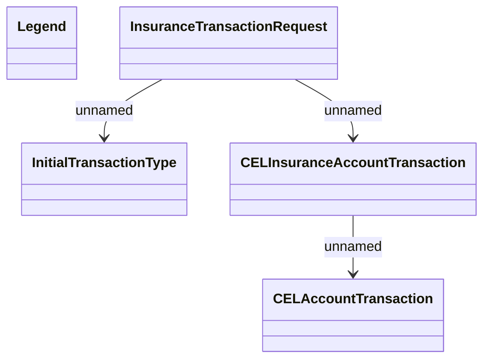

# Additional insurance transaction - JMS messages

```mermaid
classDiagram
    class InitialTransactionType["InitialTransactionType"]
    class CELAccountTransaction["CELAccountTransaction"]
    class CELInsuranceAccountTransaction["CELInsuranceAccountTransaction"]
    class Legend["Legend"]
    class InsuranceTransactionRequest["InsuranceTransactionRequest"]
    CELInsuranceAccountTransaction --> CELAccountTransaction : unnamed
    InsuranceTransactionRequest --> CELInsuranceAccountTransaction : unnamed
    InsuranceTransactionRequest --> InitialTransactionType : unnamed
```
