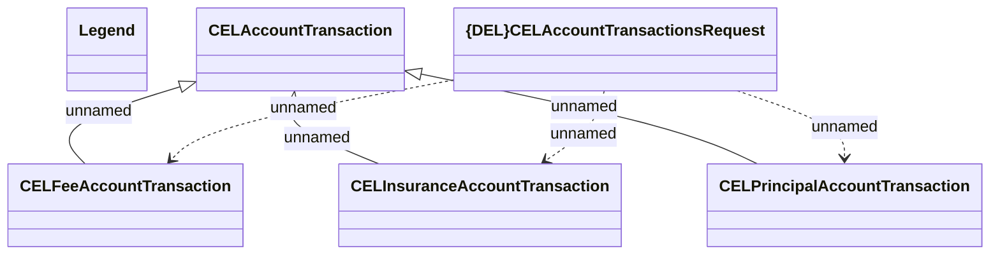

# CEL Account Transactions - JMS messages

- **Diagram Type**: Logical
- **Package**: HomerSelect/BSL/Modules/CBS Adapter/Analysis model/Account Transactions/Communication model/JMS messages
- **Diagram ID**: 102223
- **Elements**: 6
- **Connectors**: 6

