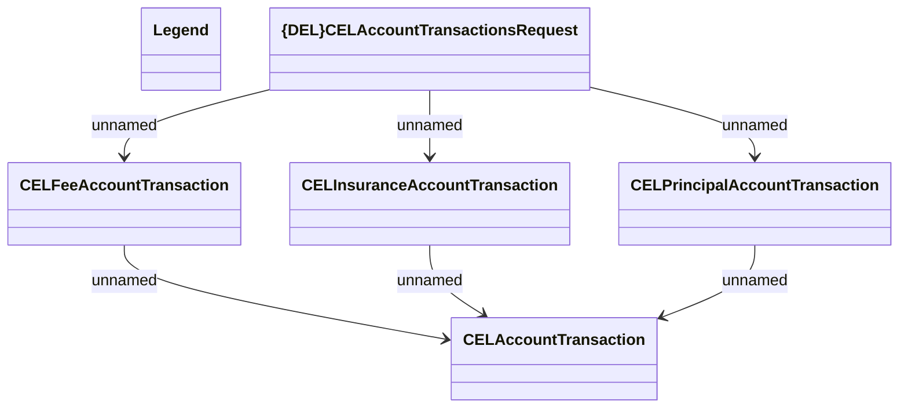

# CEL Account Transactions - JMS messages

```mermaid
classDiagram
    class Legend["Legend"]
    class CELPrincipalAccountTransaction["CELPrincipalAccountTransaction"]
    class CELInsuranceAccountTransaction["CELInsuranceAccountTransaction"]
    class CELFeeAccountTransaction["CELFeeAccountTransaction"]
    class CELAccountTransaction["CELAccountTransaction"]
    class DEL_CELAccountTransactionsRequest["{DEL}CELAccountTransactionsRequest"]
    CELFeeAccountTransaction --> CELAccountTransaction : unnamed
    CELInsuranceAccountTransaction --> CELAccountTransaction : unnamed
    CELPrincipalAccountTransaction --> CELAccountTransaction : unnamed
    DEL_CELAccountTransactionsRequest --> CELPrincipalAccountTransaction : unnamed
    DEL_CELAccountTransactionsRequest --> CELFeeAccountTransaction : unnamed
    DEL_CELAccountTransactionsRequest --> CELInsuranceAccountTransaction : unnamed
```
