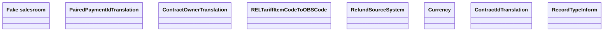

# COMMON for CBSA - LDM

- **Diagram Type**: Logical
- **Package**: HomerSelect/BSL/Modules/CBS Adapter/Analysis model/COMMON for CBS Adapter/Logical Data Model
- **Diagram ID**: 99022
- **Elements**: 8
- **Connectors**: 0

