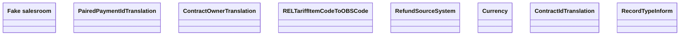

# COMMON for CBSA - LDM

```mermaid
classDiagram
    class Fake_salesroom["Fake salesroom"]
    class PairedPaymentIdTranslation["PairedPaymentIdTranslation"]
    class ContractOwnerTranslation["ContractOwnerTranslation"]
    class RELTariffItemCodeToOBSCode["RELTariffItemCodeToOBSCode"]
    class RefundSourceSystem["RefundSourceSystem"]
    class Currency["Currency"]
    class ContractIdTranslation["ContractIdTranslation"]
    class RecordTypeInform["RecordTypeInform"]
```
