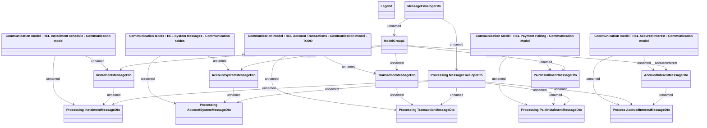

# COMMON for comm. with CaBus - Communication Model

```mermaid
classDiagram
    class Communication_model_REL_Accured_Interest_Communication_model["Communication model : REL Accured Interest - Communication model"]
    class Process_AccruedInterestMessageDto["Process AccruedInterestMessageDto"]
    class AccruedInterestMessageDto["AccruedInterestMessageDto"]
    class Communication_model_REL_Installment_schedule_Communication_m["Communication model : REL Installment schedule - Communication model"]
    class Communication_Model_REL_Payment_Pairing_Communication_Model["Communication Model : REL Payment Pairing - Communication Model"]
    class Communication_tables_REL_System_Messages_Communication_table["Communication tables : REL System Messages - Communication tables"]
    class Communication_model_REL_Account_Transactions_Communication_m["Communication model : REL Account Transactions - Communication model - TODO"]
    class Processing_InstalmentMessageDto["Processing InstalmentMessageDto"]
    class Processing_TransactionMessageDto["Processing TransactionMessageDto"]
    class Processing_AccountSystemMessageDto["Processing AccountSystemMessageDto"]
    class Processing_PaidInstalmentMessageDto["Processing PaidInstalmentMessageDto"]
    class InstalmentMessageDto["InstalmentMessageDto"]
    class PaidInstallmentMessageDto["PaidInstallmentMessageDto"]
    class TransactionMessageDto["TransactionMessageDto"]
    class ModelGroup1["ModelGroup1"]
    class AccountSystemMessageDto["AccountSystemMessageDto"]
    class Legend["Legend"]
    class Processing_MessageEnvelopeDto["Processing MessageEnvelopeDto
"]
    class MessageEnvelopeDto["MessageEnvelopeDto"]
    Communication_model_REL_Installment_schedule_Communication_m --> Processing_InstalmentMessageDto : unnamed
    Communication_model_REL_Account_Transactions_Communication_m --> Processing_TransactionMessageDto : unnamed
    Communication_tables_REL_System_Messages_Communication_table --> Processing_AccountSystemMessageDto : unnamed
    AccountSystemMessageDto --> Processing_AccountSystemMessageDto : unnamed
    Communication_Model_REL_Payment_Pairing_Communication_Model --> Processing_PaidInstalmentMessageDto : unnamed
    PaidInstallmentMessageDto --> Processing_PaidInstalmentMessageDto : unnamed
    Communication_model_REL_Installment_schedule_Communication_m --> InstalmentMessageDto : unnamed
    Communication_model_REL_Accured_Interest_Communication_model --> Process_AccruedInterestMessageDto : unnamed
    Communication_Model_REL_Payment_Pairing_Communication_Model --> PaidInstallmentMessageDto : unnamed
    Communication_model_REL_Account_Transactions_Communication_m --> TransactionMessageDto : unnamed
    Communication_tables_REL_System_Messages_Communication_table --> AccountSystemMessageDto : unnamed
    Communication_model_REL_Accured_Interest_Communication_model --> AccruedInterestMessageDto : unnamed
    MessageEnvelopeDto --> ModelGroup1 : unnamed
    MessageEnvelopeDto --> Processing_MessageEnvelopeDto : unnamed
    ModelGroup1 --> InstalmentMessageDto : unnamed
    ModelGroup1 --> AccountSystemMessageDto : unnamed
    ModelGroup1 --> TransactionMessageDto : unnamed
    ModelGroup1 --> PaidInstallmentMessageDto : unnamed
    ModelGroup1 --> AccruedInterestMessageDto : accruedInterest
    TransactionMessageDto --> Processing_TransactionMessageDto : unnamed
    InstalmentMessageDto --> Processing_InstalmentMessageDto : unnamed
    Processing_MessageEnvelopeDto --> Processing_TransactionMessageDto : unnamed
    Processing_MessageEnvelopeDto --> Processing_AccountSystemMessageDto : unnamed
    Processing_MessageEnvelopeDto --> Processing_InstalmentMessageDto : unnamed
    Processing_MessageEnvelopeDto --> Process_AccruedInterestMessageDto : unnamed
    Processing_MessageEnvelopeDto --> Processing_PaidInstalmentMessageDto : unnamed
    AccruedInterestMessageDto --> Process_AccruedInterestMessageDto : unnamed
```
