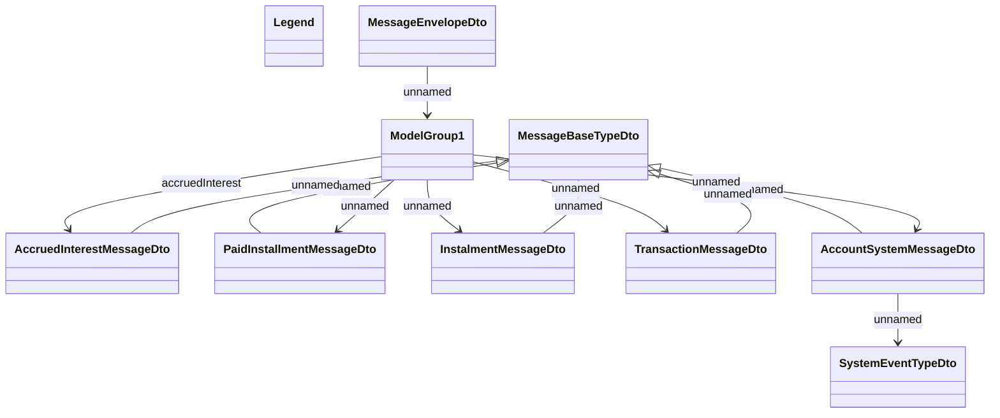

# COMMON for consumed JMS messages from CaBus

- **Diagram Type**: Logical
- **Package**: HomerSelect/BSL/Modules/CBS Adapter/Analysis model/COMMON for communication with CaBus/Communication Model/JMS messages
- **Diagram ID**: 75332
- **Elements**: 10
- **Connectors**: 12

