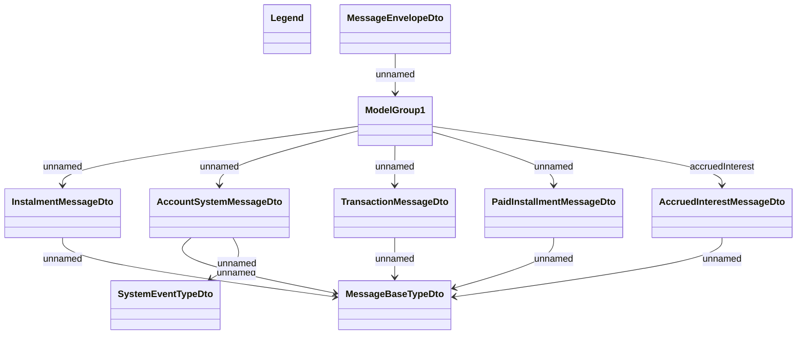

# COMMON for consumed JMS messages from CaBus

```mermaid
classDiagram
    class AccruedInterestMessageDto["AccruedInterestMessageDto"]
    class Legend["Legend"]
    class PaidInstallmentMessageDto["PaidInstallmentMessageDto"]
    class InstalmentMessageDto["InstalmentMessageDto"]
    class TransactionMessageDto["TransactionMessageDto"]
    class SystemEventTypeDto["SystemEventTypeDto"]
    class AccountSystemMessageDto["AccountSystemMessageDto"]
    class ModelGroup1["ModelGroup1"]
    class MessageEnvelopeDto["MessageEnvelopeDto"]
    class MessageBaseTypeDto["MessageBaseTypeDto"]
    PaidInstallmentMessageDto --> MessageBaseTypeDto : unnamed
    AccountSystemMessageDto --> MessageBaseTypeDto : unnamed
    AccountSystemMessageDto --> SystemEventTypeDto : unnamed
    MessageEnvelopeDto --> ModelGroup1 : unnamed
    ModelGroup1 --> InstalmentMessageDto : unnamed
    ModelGroup1 --> AccountSystemMessageDto : unnamed
    ModelGroup1 --> TransactionMessageDto : unnamed
    ModelGroup1 --> PaidInstallmentMessageDto : unnamed
    ModelGroup1 --> AccruedInterestMessageDto : accruedInterest
    TransactionMessageDto --> MessageBaseTypeDto : unnamed
    InstalmentMessageDto --> MessageBaseTypeDto : unnamed
    AccruedInterestMessageDto --> MessageBaseTypeDto : unnamed
```
