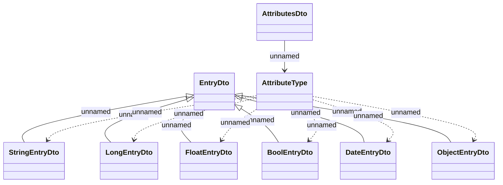

# Types - AttributeDto

- **Diagram Type**: Logical
- **Package**: HomerSelect/BSL/Modules/CBS Adapter/Analysis model/COMMON for communication with CaBus/Communication Model/JMS messages/Types
- **Diagram ID**: 102769
- **Elements**: 9
- **Connectors**: 13

