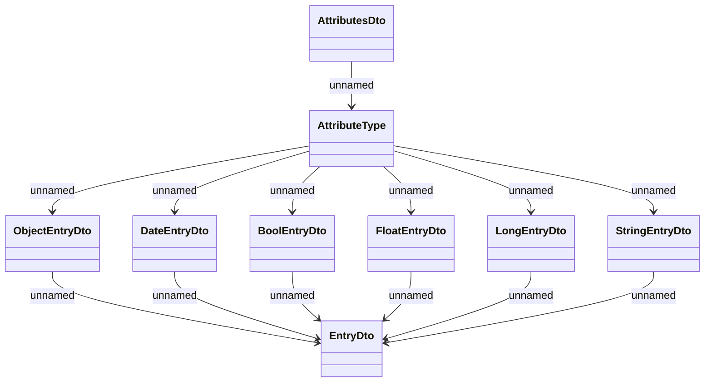

# Types - AttributeDto

```mermaid
classDiagram
    class ObjectEntryDto["ObjectEntryDto"]
    class DateEntryDto["DateEntryDto"]
    class BoolEntryDto["BoolEntryDto"]
    class FloatEntryDto["FloatEntryDto"]
    class LongEntryDto["LongEntryDto"]
    class StringEntryDto["StringEntryDto"]
    class EntryDto["EntryDto"]
    class AttributeType["AttributeType"]
    class AttributesDto["AttributesDto"]
    AttributesDto --> AttributeType : unnamed
    ObjectEntryDto --> EntryDto : unnamed
    DateEntryDto --> EntryDto : unnamed
    BoolEntryDto --> EntryDto : unnamed
    FloatEntryDto --> EntryDto : unnamed
    LongEntryDto --> EntryDto : unnamed
    StringEntryDto --> EntryDto : unnamed
    AttributeType --> StringEntryDto : unnamed
    AttributeType --> LongEntryDto : unnamed
    AttributeType --> FloatEntryDto : unnamed
    AttributeType --> BoolEntryDto : unnamed
    AttributeType --> DateEntryDto : unnamed
    AttributeType --> ObjectEntryDto : unnamed
```
