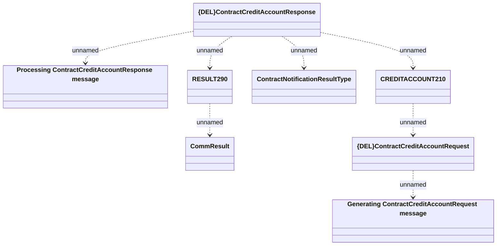

# Contract credit account - Communication model

- **Diagram Type**: Logical
- **Package**: HomerSelect/BSL/Modules/CBS Adapter/Analysis model/Contract/Communication model
- **Diagram ID**: 60128
- **Elements**: 8
- **Connectors**: 7

