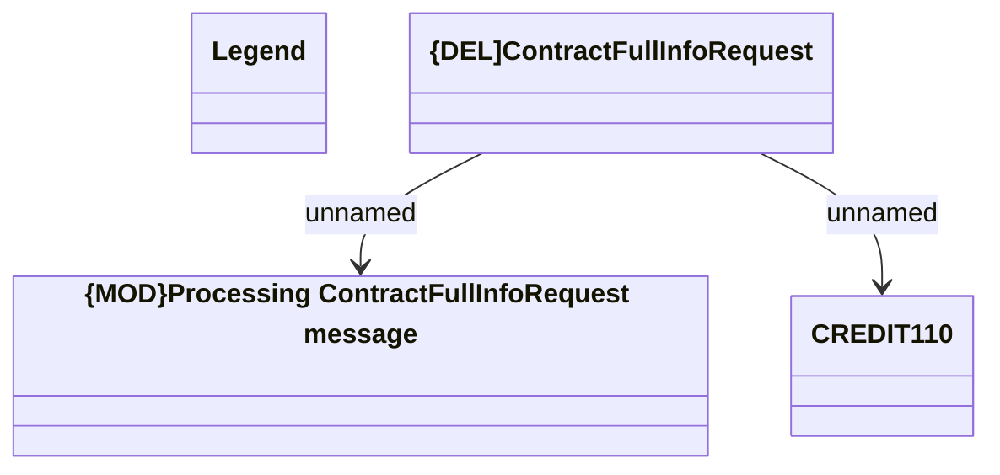

# Contract notifications - Communication model

```mermaid
classDiagram
    class MOD_Processing_ContractFullInfoRequest_message["{MOD}Processing ContractFullInfoRequest message"]
    class Legend["Legend"]
    class DEL_ContractFullInfoRequest["{DEL]ContractFullInfoRequest"]
    class CREDIT110["CREDIT110"]
    DEL_ContractFullInfoRequest --> MOD_Processing_ContractFullInfoRequest_message : unnamed
    DEL_ContractFullInfoRequest --> CREDIT110 : unnamed
```
