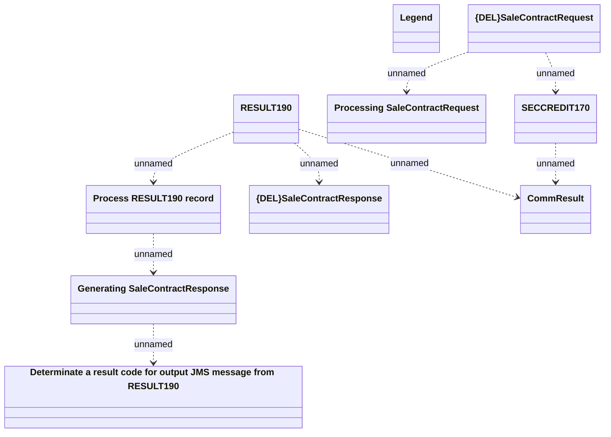

# Contract sale - Communication model

- **Diagram Type**: Logical
- **Package**: HomerSelect/BSL/Modules/CBS Adapter/Analysis model/Contract/Communication model
- **Diagram ID**: 60126
- **Elements**: 10
- **Connectors**: 8

