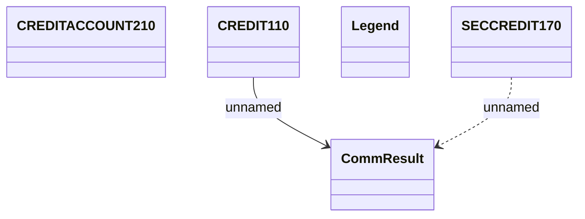

# Contract - Communication tables

- **Diagram Type**: Logical
- **Package**: HomerSelect/BSL/Modules/CBS Adapter/Analysis model/Contract/Communication model/Communication tables
- **Diagram ID**: 55310
- **Elements**: 5
- **Connectors**: 2

