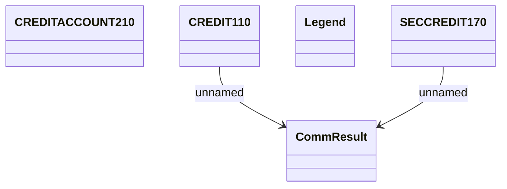

# Contract - Communication tables

```mermaid
classDiagram
    class CREDITACCOUNT210["CREDITACCOUNT210"]
    class CREDIT110["CREDIT110"]
    class CommResult["CommResult"]
    class Legend["Legend"]
    class SECCREDIT170["SECCREDIT170"]
    CREDIT110 --> CommResult : unnamed
    SECCREDIT170 --> CommResult : unnamed
```
