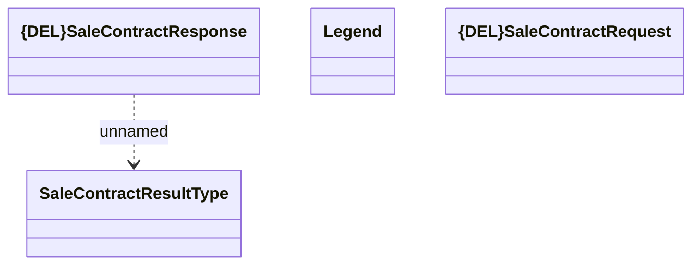

# Contract sale - JMS messages

- **Diagram Type**: Logical
- **Package**: HomerSelect/BSL/Modules/CBS Adapter/Analysis model/Contract/Communication model/JMS messages
- **Diagram ID**: 153191
- **Elements**: 4
- **Connectors**: 1

