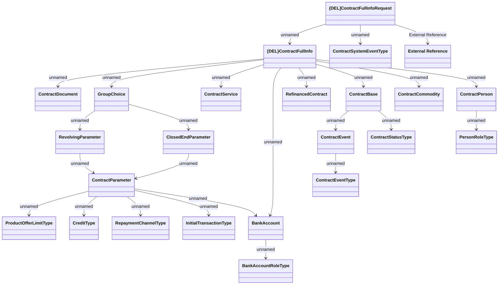

# {DEL}Contract full info notification - JMS messages

```mermaid
classDiagram
    class RefinancedContract["RefinancedContract"]
    class ContractDocument["ContractDocument"]
    class ProductOfferLimitType["ProductOfferLimitType"]
    class ContractSystemEventType["ContractSystemEventType"]
    class BankAccountRoleType["BankAccountRoleType"]
    class GroupChoice["GroupChoice"]
    class DEL_ContractFullInfoRequest["{DEL]ContractFullInfoRequest"]
    class ContractService["ContractService"]
    class ContractEventType["ContractEventType"]
    class ContractEvent["ContractEvent"]
    class BankAccount["BankAccount"]
    class CreditType["CreditType"]
    class DEL_ContractFullInfo["{DEL}ContractFullInfo"]
    class ContractStatusType["ContractStatusType"]
    class RepaymentChannelType["RepaymentChannelType"]
    class ContractCommodity["ContractCommodity"]
    class InitialTransactionType["InitialTransactionType"]
    class RevolvingParameter["RevolvingParameter"]
    class ClosedEndParameter["ClosedEndParameter"]
    class ContractParameter["ContractParameter"]
    class PersonRoleType["PersonRoleType"]
    class ContractPerson["ContractPerson"]
    class ContractBase["ContractBase"]
    class External_Reference["External Reference"]
    DEL_ContractFullInfoRequest --> DEL_ContractFullInfo : unnamed
    DEL_ContractFullInfo --> ContractDocument : unnamed
    ContractParameter --> ProductOfferLimitType : unnamed
    DEL_ContractFullInfoRequest --> ContractSystemEventType : unnamed
    BankAccount --> BankAccountRoleType : unnamed
    DEL_ContractFullInfo --> GroupChoice : unnamed
    DEL_ContractFullInfo --> ContractService : unnamed
    ContractEvent --> ContractEventType : unnamed
    ContractBase --> ContractEvent : unnamed
    DEL_ContractFullInfo --> BankAccount : unnamed
    DEL_ContractFullInfo --> RefinancedContract : unnamed
    ContractParameter --> CreditType : unnamed
    DEL_ContractFullInfo --> ContractBase : unnamed
    ContractBase --> ContractStatusType : unnamed
    ContractParameter --> RepaymentChannelType : unnamed
    DEL_ContractFullInfo --> ContractCommodity : unnamed
    ContractParameter --> InitialTransactionType : unnamed
    GroupChoice --> RevolvingParameter : unnamed
    GroupChoice --> ClosedEndParameter : unnamed
    RevolvingParameter --> ContractParameter : unnamed
    ClosedEndParameter --> ContractParameter : unnamed
    ContractPerson --> PersonRoleType : unnamed
    DEL_ContractFullInfo --> ContractPerson : unnamed
    ContractParameter --> BankAccount : unnamed
    DEL_ContractFullInfoRequest --> External_Reference : External Reference
```
