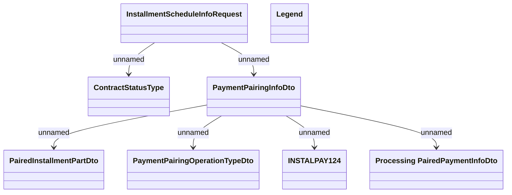

# CEL Payment Pairing - Communication Model

```mermaid
classDiagram
    class ContractStatusType["ContractStatusType"]
    class InstallmentScheduleInfoRequest["InstallmentScheduleInfoRequest"]
    class Legend["Legend"]
    class Processing_PairedPaymentInfoDto["Processing PairedPaymentInfoDto"]
    class INSTALPAY124["INSTALPAY124"]
    class PaymentPairingOperationTypeDto["PaymentPairingOperationTypeDto"]
    class PairedInstallmentPartDto["PairedInstallmentPartDto"]
    class PaymentPairingInfoDto["PaymentPairingInfoDto"]
    PaymentPairingInfoDto --> PairedInstallmentPartDto : unnamed
    PaymentPairingInfoDto --> PaymentPairingOperationTypeDto : unnamed
    PaymentPairingInfoDto --> INSTALPAY124 : unnamed
    PaymentPairingInfoDto --> Processing_PairedPaymentInfoDto : unnamed
    InstallmentScheduleInfoRequest --> ContractStatusType : unnamed
    InstallmentScheduleInfoRequest --> PaymentPairingInfoDto : unnamed
```
