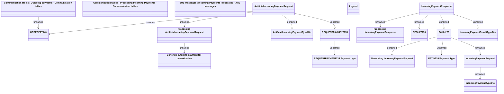

# Processing Incoming Payments - Communication Model

```mermaid
classDiagram
    class Generate_outgoing_payment_for_consolidation["Generate outgoing payment for consolidation"]
    class Communication_tables_Outgoing_payments_Communication_tables["Communication tables : Outgoing payments - Communication tables"]
    class ORDERPAY140["ORDERPAY140"]
    class Communication_tables_Processing_Incoming_Payments_Communicat["Communication tables : Processing Incoming Payments - Communication tables"]
    class JMS_messages_Incoming_Payments_Processing_JMS_messages["JMS messages : Incoming Payments Processing - JMS messages"]
    class JMS_messages_Incoming_Payments_Processing_JMS_messages["JMS messages : Incoming Payments Processing - JMS messages"]
    class Processing_ArtificialIncomingPaymentRequest["Processing ArtificialIncomingPaymentRequest"]
    class ArtificialIncomingPaymentTypeDto["ArtificialIncomingPaymentTypeDto"]
    class ArtificialIncomingPaymentRequest["ArtificialIncomingPaymentRequest"]
    class REQUESTPAYMENT135_Payment_type["REQUESTPAYMENT135 Payment type"]
    class REQUESTPAYMENT135["REQUESTPAYMENT135"]
    class Generating_IncomingPaymentRequest["Generating IncomingPaymentRequest"]
    class Legend["Legend"]
    class Processing_IncomingPaymentResponse["Processing IncomingPaymentResponse"]
    class PAYIN220_Payment_Type["PAYIN220 Payment Type"]
    class RESULT290["RESULT290"]
    class PAYIN220["PAYIN220"]
    class IncomingPaymentResultTypeDto["IncomingPaymentResultTypeDto"]
    class IncomingPaymentResponse["IncomingPaymentResponse"]
    class IncomingPaymentTypeDto["IncomingPaymentTypeDto"]
    class IncomingPaymentRequest["IncomingPaymentRequest"]
    Communication_tables_Outgoing_payments_Communication_tables --> ORDERPAY140 : unnamed
    ArtificialIncomingPaymentRequest --> ORDERPAY140 : unnamed
    ArtificialIncomingPaymentRequest --> Processing_ArtificialIncomingPaymentRequest : unnamed
    IncomingPaymentResponse --> Processing_IncomingPaymentResponse : unnamed
    IncomingPaymentResponse --> RESULT290 : unnamed
    IncomingPaymentResponse --> IncomingPaymentResultTypeDto : unnamed
    IncomingPaymentRequest --> IncomingPaymentTypeDto : unnamed
    ArtificialIncomingPaymentRequest --> ArtificialIncomingPaymentTypeDto : unnamed
    IncomingPaymentResponse --> PAYIN220 : unnamed
    ArtificialIncomingPaymentRequest --> REQUESTPAYMENT135 : unnamed
    Processing_ArtificialIncomingPaymentRequest --> Generate_outgoing_payment_for_consolidation : unnamed
    PAYIN220 --> Generating_IncomingPaymentRequest : unnamed
    PAYIN220 --> PAYIN220_Payment_Type : unnamed
    PAYIN220 --> IncomingPaymentRequest : unnamed
    REQUESTPAYMENT135 --> REQUESTPAYMENT135_Payment_type : unnamed
```
