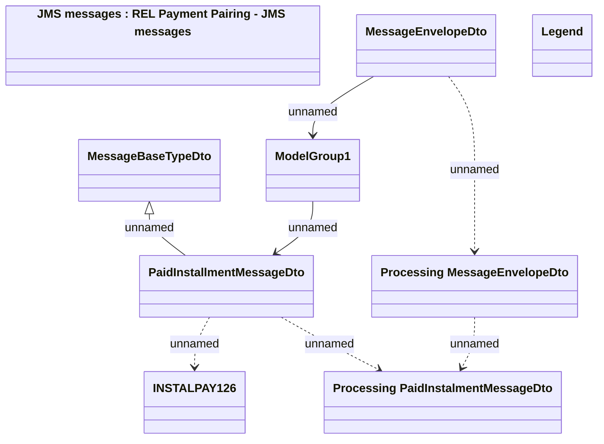

# REL Payment Pairing - Communication Model

- **Diagram Type**: Logical
- **Package**: HomerSelect/BSL/Modules/CBS Adapter/Analysis model/Incoming Payments/Communication Model
- **Diagram ID**: 92795
- **Elements**: 9
- **Connectors**: 7

