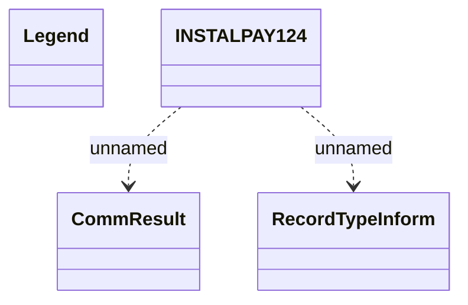

# CEL Payment Pairing - Communication tables

- **Diagram Type**: Logical
- **Package**: HomerSelect/BSL/Modules/CBS Adapter/Analysis model/Incoming Payments/Communication Model/Communication tables
- **Diagram ID**: 97454
- **Elements**: 4
- **Connectors**: 2

