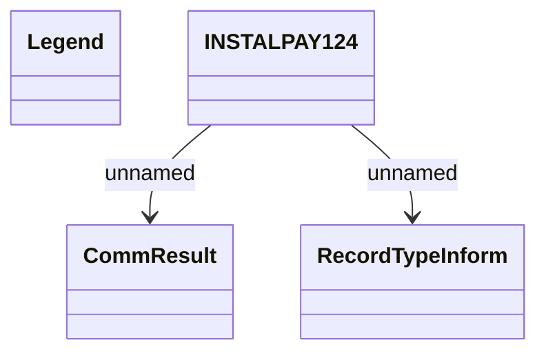

# CEL Payment Pairing - Communication tables

```mermaid
classDiagram
    class RecordTypeInform["RecordTypeInform"]
    class Legend["Legend"]
    class CommResult["CommResult"]
    class INSTALPAY124["INSTALPAY124"]
    INSTALPAY124 --> CommResult : unnamed
    INSTALPAY124 --> RecordTypeInform : unnamed
```
