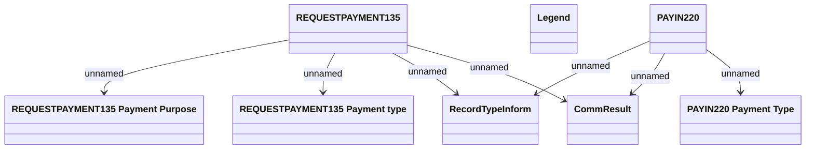

# Processing Incoming Payments - Communication tables

```mermaid
classDiagram
    class REQUESTPAYMENT135_Payment_Purpose["REQUESTPAYMENT135 Payment Purpose"]
    class REQUESTPAYMENT135_Payment_type["REQUESTPAYMENT135 Payment type"]
    class REQUESTPAYMENT135["REQUESTPAYMENT135"]
    class RecordTypeInform["RecordTypeInform"]
    class Legend["Legend"]
    class CommResult["CommResult"]
    class PAYIN220_Payment_Type["PAYIN220 Payment Type"]
    class PAYIN220["PAYIN220"]
    PAYIN220 --> PAYIN220_Payment_Type : unnamed
    REQUESTPAYMENT135 --> CommResult : unnamed
    PAYIN220 --> CommResult : unnamed
    REQUESTPAYMENT135 --> RecordTypeInform : unnamed
    PAYIN220 --> RecordTypeInform : unnamed
    REQUESTPAYMENT135 --> REQUESTPAYMENT135_Payment_type : unnamed
    REQUESTPAYMENT135 --> REQUESTPAYMENT135_Payment_Purpose : unnamed
```
