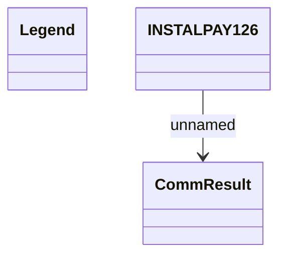

# REL Payment Pairing - Communication tables

```mermaid
classDiagram
    class CommResult["CommResult"]
    class Legend["Legend"]
    class INSTALPAY126["INSTALPAY126"]
    INSTALPAY126 --> CommResult : unnamed
```
