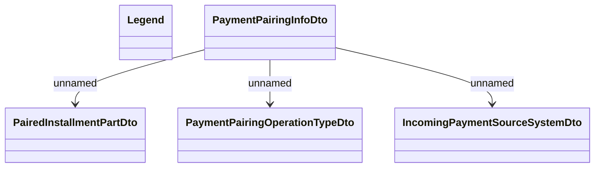

# CEL Payment Pairing - JMS messages

```mermaid
classDiagram
    class IncomingPaymentSourceSystemDto["IncomingPaymentSourceSystemDto"]
    class Legend["Legend"]
    class PaymentPairingOperationTypeDto["PaymentPairingOperationTypeDto"]
    class PairedInstallmentPartDto["PairedInstallmentPartDto"]
    class PaymentPairingInfoDto["PaymentPairingInfoDto"]
    PaymentPairingInfoDto --> PairedInstallmentPartDto : unnamed
    PaymentPairingInfoDto --> PaymentPairingOperationTypeDto : unnamed
    PaymentPairingInfoDto --> IncomingPaymentSourceSystemDto : unnamed
```
