# Incoming Payments Processing - JMS messages

- **Diagram Type**: Logical
- **Package**: HomerSelect/BSL/Modules/CBS Adapter/Analysis model/Incoming Payments/Communication Model/JMS messages
- **Diagram ID**: 72423
- **Elements**: 14
- **Connectors**: 9

```mermaid
classDiagram
    class Communication_Model_Processing_Incoming_Payments_Communicati["Communication Model : Processing Incoming Payments - Communication Model"]
    class IncomingPaymentOperationTypeDto["IncomingPaymentOperationTypeDto"]
    class IncomingPaymentSourceSystemDto["IncomingPaymentSourceSystemDto"]
    class ArtificialIncomingPaymentSourceSystemDto["ArtificialIncomingPaymentSourceSystemDto"]
    class ArtificialIncomingPaymentOperationTypeDto["ArtificialIncomingPaymentOperationTypeDto"]
    class ArtificialIncomingPaymentPurposeTypeDto["ArtificialIncomingPaymentPurposeTypeDto"]
    class ArtificialIncomingPaymentTypeDto["ArtificialIncomingPaymentTypeDto"]
    class ArtificialIncomingPaymentRequest["ArtificialIncomingPaymentRequest"]
    class Legend["Legend"]
    class IncomingPaymentTypeDto["IncomingPaymentTypeDto"]
    class MoneyDto["MoneyDto"]
    class IncomingPaymentResultTypeDto["IncomingPaymentResultTypeDto"]
    class IncomingPaymentResponse["IncomingPaymentResponse"]
    class IncomingPaymentRequest["IncomingPaymentRequest"]
    IncomingPaymentResponse ..> IncomingPaymentResultTypeDto : unnamed
    IncomingPaymentRequest ..> IncomingPaymentSourceSystemDto : unnamed
    IncomingPaymentRequest ..> IncomingPaymentTypeDto : unnamed
    IncomingPaymentRequest ..> MoneyDto : unnamed
    IncomingPaymentRequest ..> IncomingPaymentOperationTypeDto : unnamed
    ArtificialIncomingPaymentRequest ..> ArtificialIncomingPaymentTypeDto : unnamed
    ArtificialIncomingPaymentRequest ..> ArtificialIncomingPaymentPurposeTypeDto : unnamed
    ArtificialIncomingPaymentRequest ..> ArtificialIncomingPaymentOperationTypeDto : unnamed
    ArtificialIncomingPaymentRequest ..> ArtificialIncomingPaymentSourceSystemDto : unnamed
```

