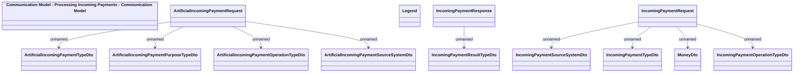

# Incoming Payments Processing - JMS messages

```mermaid
classDiagram
    class Communication_Model_Processing_Incoming_Payments_Communicati["Communication Model : Processing Incoming Payments - Communication Model"]
    class IncomingPaymentOperationTypeDto["IncomingPaymentOperationTypeDto"]
    class IncomingPaymentSourceSystemDto["IncomingPaymentSourceSystemDto"]
    class ArtificialIncomingPaymentSourceSystemDto["ArtificialIncomingPaymentSourceSystemDto"]
    class ArtificialIncomingPaymentOperationTypeDto["ArtificialIncomingPaymentOperationTypeDto"]
    class ArtificialIncomingPaymentPurposeTypeDto["ArtificialIncomingPaymentPurposeTypeDto"]
    class ArtificialIncomingPaymentTypeDto["ArtificialIncomingPaymentTypeDto"]
    class ArtificialIncomingPaymentRequest["ArtificialIncomingPaymentRequest"]
    class Legend["Legend"]
    class IncomingPaymentTypeDto["IncomingPaymentTypeDto"]
    class MoneyDto["MoneyDto"]
    class IncomingPaymentResultTypeDto["IncomingPaymentResultTypeDto"]
    class IncomingPaymentResponse["IncomingPaymentResponse"]
    class IncomingPaymentRequest["IncomingPaymentRequest"]
    IncomingPaymentResponse --> IncomingPaymentResultTypeDto : unnamed
    IncomingPaymentRequest --> IncomingPaymentSourceSystemDto : unnamed
    IncomingPaymentRequest --> IncomingPaymentTypeDto : unnamed
    IncomingPaymentRequest --> MoneyDto : unnamed
    IncomingPaymentRequest --> IncomingPaymentOperationTypeDto : unnamed
    ArtificialIncomingPaymentRequest --> ArtificialIncomingPaymentTypeDto : unnamed
    ArtificialIncomingPaymentRequest --> ArtificialIncomingPaymentPurposeTypeDto : unnamed
    ArtificialIncomingPaymentRequest --> ArtificialIncomingPaymentOperationTypeDto : unnamed
    ArtificialIncomingPaymentRequest --> ArtificialIncomingPaymentSourceSystemDto : unnamed
```
