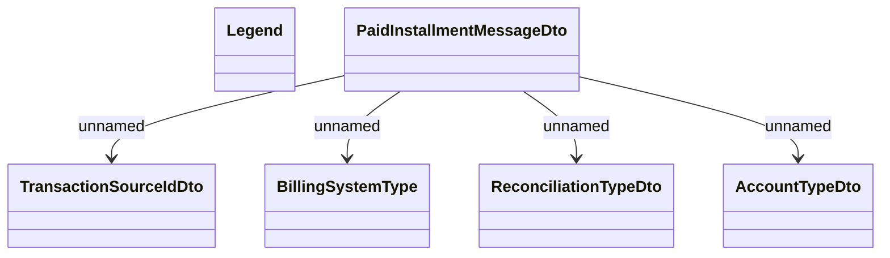

# REL Payment Pairing - JMS messages

```mermaid
classDiagram
    class AccountTypeDto["AccountTypeDto"]
    class ReconciliationTypeDto["ReconciliationTypeDto"]
    class BillingSystemType["BillingSystemType"]
    class TransactionSourceIdDto["TransactionSourceIdDto"]
    class Legend["Legend"]
    class PaidInstallmentMessageDto["PaidInstallmentMessageDto"]
    PaidInstallmentMessageDto --> TransactionSourceIdDto : unnamed
    PaidInstallmentMessageDto --> BillingSystemType : unnamed
    PaidInstallmentMessageDto --> ReconciliationTypeDto : unnamed
    PaidInstallmentMessageDto --> AccountTypeDto : unnamed
```
