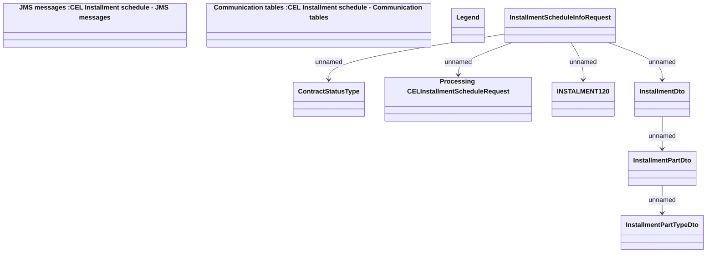

# CEL Installment schedule - Communication model

```mermaid
classDiagram
    class ContractStatusType["ContractStatusType"]
    class JMS_messages_CEL_Installment_schedule_JMS_messages["JMS messages :CEL Installment schedule - JMS messages"]
    class Communication_tables_CEL_Installment_schedule_Communication_["Communication tables :CEL Installment schedule - Communication tables"]
    class InstallmentPartTypeDto["InstallmentPartTypeDto"]
    class Processing_CELInstallmentScheduleRequest["Processing CELInstallmentScheduleRequest"]
    class INSTALMENT120["INSTALMENT120"]
    class InstallmentPartDto["InstallmentPartDto"]
    class InstallmentDto["InstallmentDto"]
    class Legend["Legend"]
    class InstallmentScheduleInfoRequest["InstallmentScheduleInfoRequest"]
    InstallmentScheduleInfoRequest --> InstallmentDto : unnamed
    InstallmentScheduleInfoRequest --> INSTALMENT120 : unnamed
    InstallmentScheduleInfoRequest --> Processing_CELInstallmentScheduleRequest : unnamed
    InstallmentScheduleInfoRequest --> ContractStatusType : unnamed
    InstallmentDto --> InstallmentPartDto : unnamed
    InstallmentPartDto --> InstallmentPartTypeDto : unnamed
```
