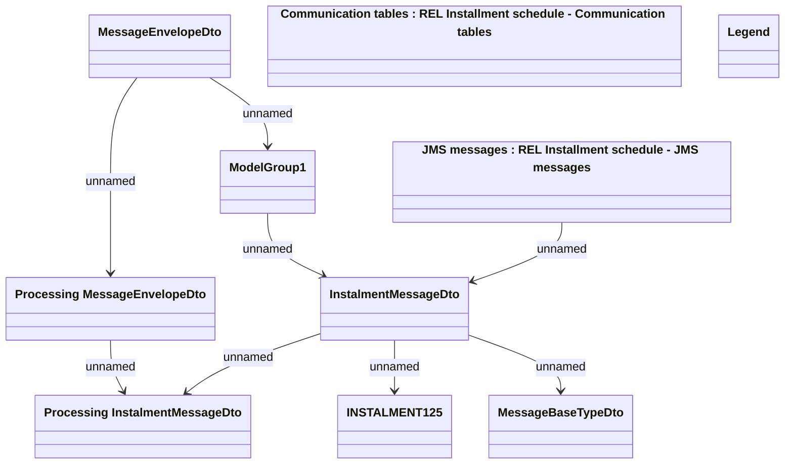

# REL Installment schedule - Communication model

```mermaid
classDiagram
    class MessageBaseTypeDto["MessageBaseTypeDto"]
    class ModelGroup1["ModelGroup1"]
    class Processing_MessageEnvelopeDto["Processing MessageEnvelopeDto
"]
    class MessageEnvelopeDto["MessageEnvelopeDto"]
    class InstalmentMessageDto["InstalmentMessageDto"]
    class Communication_tables_REL_Installment_schedule_Communication_["Communication tables : REL Installment schedule - Communication tables"]
    class JMS_messages_REL_Installment_schedule_JMS_messages["JMS messages : REL Installment schedule - JMS messages"]
    class Processing_InstalmentMessageDto["Processing InstalmentMessageDto"]
    class INSTALMENT125["INSTALMENT125"]
    class Legend["Legend"]
    InstalmentMessageDto --> INSTALMENT125 : unnamed
    InstalmentMessageDto --> Processing_InstalmentMessageDto : unnamed
    JMS_messages_REL_Installment_schedule_JMS_messages --> InstalmentMessageDto : unnamed
    MessageEnvelopeDto --> Processing_MessageEnvelopeDto : unnamed
    MessageEnvelopeDto --> ModelGroup1 : unnamed
    InstalmentMessageDto --> MessageBaseTypeDto : unnamed
    ModelGroup1 --> InstalmentMessageDto : unnamed
    Processing_MessageEnvelopeDto --> Processing_InstalmentMessageDto : unnamed
```
