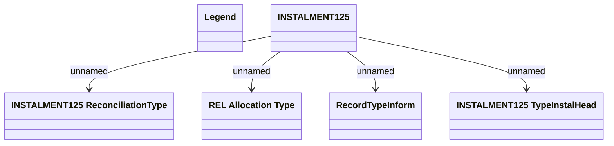

# REL Installment schedule - Communication tables

```mermaid
classDiagram
    class REL_Allocation_Type["REL Allocation Type"]
    class RecordTypeInform["RecordTypeInform"]
    class INSTALMENT125_ReconciliationType["INSTALMENT125 ReconciliationType"]
    class INSTALMENT125_TypeInstalHead["INSTALMENT125 TypeInstalHead"]
    class Legend["Legend"]
    class INSTALMENT125["INSTALMENT125"]
    INSTALMENT125 --> INSTALMENT125_ReconciliationType : unnamed
    INSTALMENT125 --> REL_Allocation_Type : unnamed
    INSTALMENT125 --> RecordTypeInform : unnamed
    INSTALMENT125 --> INSTALMENT125_TypeInstalHead : unnamed
```
