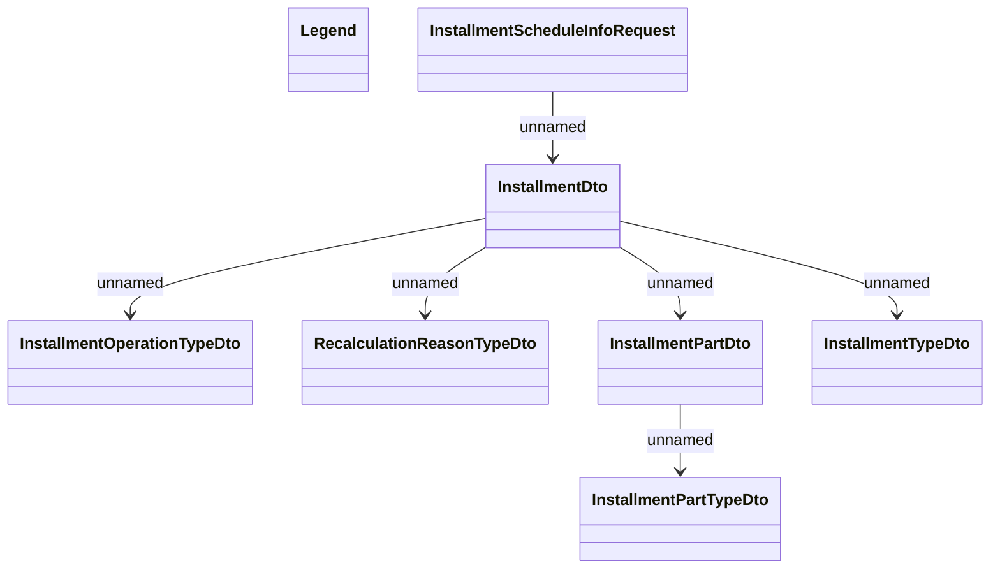

# CEL Installment schedule - JMS messages

```mermaid
classDiagram
    class InstallmentPartTypeDto["InstallmentPartTypeDto"]
    class InstallmentOperationTypeDto["InstallmentOperationTypeDto"]
    class RecalculationReasonTypeDto["RecalculationReasonTypeDto"]
    class InstallmentPartDto["InstallmentPartDto"]
    class InstallmentTypeDto["InstallmentTypeDto"]
    class InstallmentDto["InstallmentDto"]
    class Legend["Legend"]
    class InstallmentScheduleInfoRequest["InstallmentScheduleInfoRequest"]
    InstallmentScheduleInfoRequest --> InstallmentDto : unnamed
    InstallmentDto --> InstallmentTypeDto : unnamed
    InstallmentDto --> InstallmentOperationTypeDto : unnamed
    InstallmentDto --> InstallmentPartDto : unnamed
    InstallmentDto --> RecalculationReasonTypeDto : unnamed
    InstallmentPartDto --> InstallmentPartTypeDto : unnamed
```
