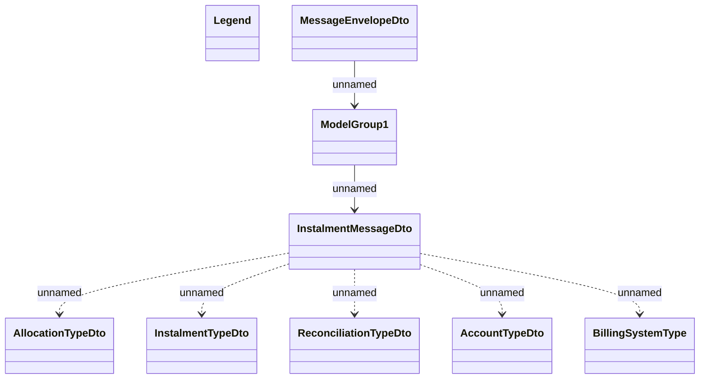

# REL Installment schedule - JMS messages

- **Diagram Type**: Logical
- **Package**: HomerSelect/BSL/Modules/CBS Adapter/Analysis model/Installment Schedule/Communication model/JMS messages
- **Diagram ID**: 75357
- **Elements**: 9
- **Connectors**: 7

