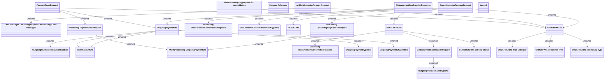

# Outgoing payments - Communication Model

```mermaid
classDiagram
    class JMS_messages_Incoming_Payments_Processing_JMS_messages["JMS messages : Incoming Payments Processing - JMS messages"]
    class ArtificialIncomingPaymentRequest["ArtificialIncomingPaymentRequest"]
    class Generate_outgoing_payment_for_consolidation["Generate outgoing payment for consolidation"]
    class External_Reference["External Reference"]
    class OutgoingPaymentTransactionSubtype["OutgoingPaymentTransactionSubtype"]
    class Processing_PaymentOrderRequest["Processing PaymentOrderRequest"]
    class Processing_CancelOugoingPaymentRequest["Processing CancelOugoingPaymentRequest"]
    class PaymentOrderRequest["PaymentOrderRequest"]
    class CancelOutgoingPaymentRequest["CancelOutgoingPaymentRequest"]
    class DisbursementConfirmationResponse["DisbursementConfirmationResponse"]
    class Processing_DisbursementConfirmationResponse["Processing DisbursementConfirmationResponse"]
    class DisbursementConfirmationResultTypeDto["DisbursementConfirmationResultTypeDto"]
    class RESULT290["RESULT290"]
    class BankAccountDto["BankAccountDto"]
    class Legend["Legend"]
    class MOD_Processing_OutgoingPaymentDto["{MOD}Processing OutgoingPaymentDto"]
    class Generating_DisbursementConfirmationRequest["Generating DisbursementConfirmationRequest "]
    class OutgoingPaymentTypeDto["OutgoingPaymentTypeDto"]
    class OutgoingPaymentEventTypeDto["OutgoingPaymentEventTypeDto"]
    class OutgoingPaymentChannelDto["OutgoingPaymentChannelDto"]
    class DisbursementConfirmationRequest["DisbursementConfirmationRequest"]
    class OutgoingPaymentDto["OutgoingPaymentDto"]
    class STATEMENT240_Delivery_Status["STATEMENT240 Delivery Status"]
    class ORDERPAY140_Type_Orderpay["ORDERPAY140 Type Orderpay"]
    class ORDERPAY140_Transfer_Type["ORDERPAY140 Transfer Type"]
    class ORDERPAY140_Beneficiary_Type["ORDERPAY140 Beneficiary Type"]
    class STATEMENT240["STATEMENT240"]
    class ORDERPAY140["ORDERPAY140"]
    DisbursementConfirmationRequest --> OutgoingPaymentEventTypeDto : unnamed
    OutgoingPaymentDto --> OutgoingPaymentTransactionSubtype : unnamed
    PaymentOrderRequest --> Processing_PaymentOrderRequest : unnamed
    CancelOutgoingPaymentRequest --> Processing_CancelOugoingPaymentRequest : unnamed
    DisbursementConfirmationResponse --> Processing_DisbursementConfirmationResponse : unnamed
    DisbursementConfirmationResponse --> DisbursementConfirmationResultTypeDto : unnamed
    DisbursementConfirmationResponse --> RESULT290 : unnamed
    OutgoingPaymentDto --> BankAccountDto : unnamed
    OutgoingPaymentDto --> BankAccountDto : unnamed
    Processing_PaymentOrderRequest --> MOD_Processing_OutgoingPaymentDto : unnamed
    Processing_CancelOugoingPaymentRequest --> MOD_Processing_OutgoingPaymentDto : unnamed
    ArtificialIncomingPaymentRequest --> JMS_messages_Incoming_Payments_Processing_JMS_messages : unnamed
    OutgoingPaymentDto --> OutgoingPaymentTypeDto : unnamed
    PaymentOrderRequest --> ORDERPAY140 : unnamed
    OutgoingPaymentDto --> OutgoingPaymentChannelDto : unnamed
    PaymentOrderRequest --> OutgoingPaymentDto : unnamed
    CancelOutgoingPaymentRequest --> OutgoingPaymentDto : unnamed
    STATEMENT240 --> STATEMENT240_Delivery_Status : unnamed
    ORDERPAY140 --> ORDERPAY140_Type_Orderpay : unnamed
    ORDERPAY140 --> ORDERPAY140_Transfer_Type : unnamed
    ORDERPAY140 --> ORDERPAY140_Beneficiary_Type : unnamed
    DisbursementConfirmationResponse --> STATEMENT240 : unnamed
    ArtificialIncomingPaymentRequest --> ORDERPAY140 : unnamed
    CancelOutgoingPaymentRequest --> ORDERPAY140 : unnamed
    STATEMENT240 --> Generating_DisbursementConfirmationRequest : unnamed
    STATEMENT240 --> DisbursementConfirmationRequest : unnamed
```
