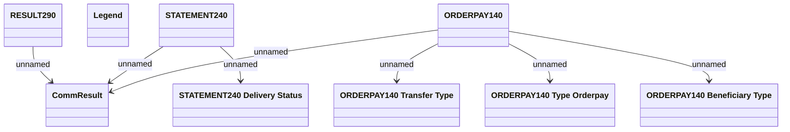

# Outgoing payments - Communication tables

```mermaid
classDiagram
    class RESULT290["RESULT290"]
    class ORDERPAY140_Beneficiary_Type["ORDERPAY140 Beneficiary Type"]
    class ORDERPAY140_Transfer_Type["ORDERPAY140 Transfer Type"]
    class ORDERPAY140_Type_Orderpay["ORDERPAY140 Type Orderpay"]
    class STATEMENT240_Delivery_Status["STATEMENT240 Delivery Status"]
    class CommResult["CommResult"]
    class Legend["Legend"]
    class STATEMENT240["STATEMENT240"]
    class ORDERPAY140["ORDERPAY140"]
    RESULT290 --> CommResult : unnamed
    STATEMENT240 --> STATEMENT240_Delivery_Status : unnamed
    STATEMENT240 --> CommResult : unnamed
    ORDERPAY140 --> ORDERPAY140_Transfer_Type : unnamed
    ORDERPAY140 --> ORDERPAY140_Type_Orderpay : unnamed
    ORDERPAY140 --> ORDERPAY140_Beneficiary_Type : unnamed
    ORDERPAY140 --> CommResult : unnamed
```
