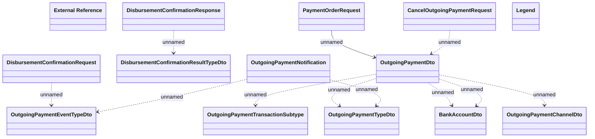

# Outgoing payments - JMS messages

- **Diagram Type**: Logical
- **Package**: HomerSelect/BSL/Modules/CBS Adapter/Analysis model/Outgoing Payments/Communication Model/JMS messages
- **Diagram ID**: 142877
- **Elements**: 14
- **Connectors**: 11

