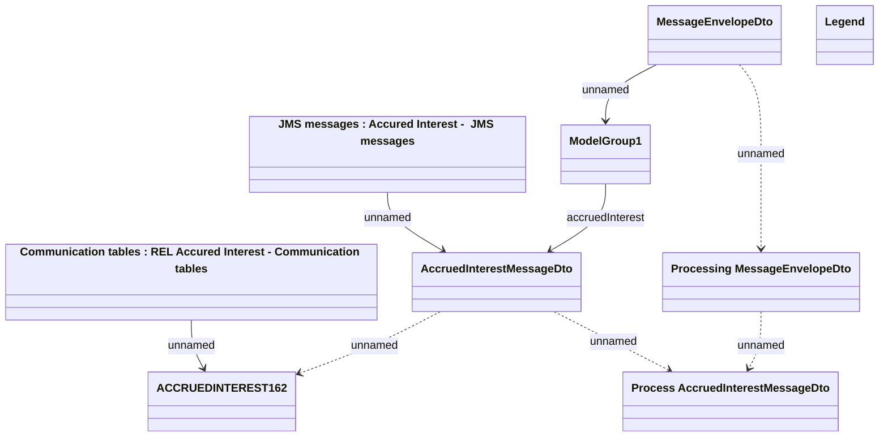

# REL Accured Interest - Communication model

- **Diagram Type**: Logical
- **Package**: HomerSelect/BSL/Modules/CBS Adapter/Analysis model/REL Account Messages/Communication model
- **Diagram ID**: 75331
- **Elements**: 9
- **Connectors**: 8

