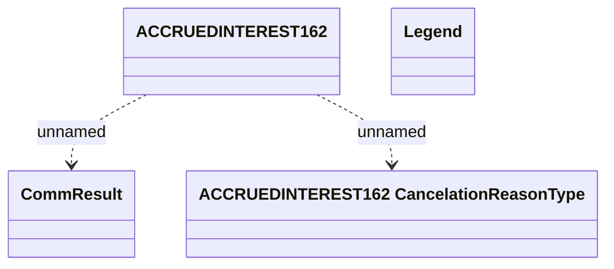

# REL Accured Interest - Communication tables

- **Diagram Type**: Logical
- **Package**: HomerSelect/BSL/Modules/CBS Adapter/Analysis model/REL Account Messages/Communication model/Communication tables
- **Diagram ID**: 76020
- **Elements**: 4
- **Connectors**: 2

