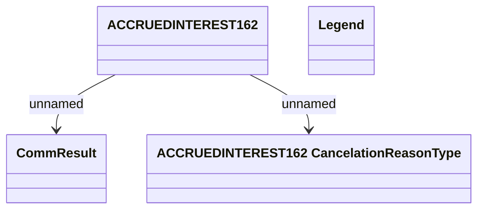

# REL Accured Interest - Communication tables

```mermaid
classDiagram
    class CommResult["CommResult"]
    class ACCRUEDINTEREST162_CancelationReasonType["ACCRUEDINTEREST162 CancelationReasonType"]
    class ACCRUEDINTEREST162["ACCRUEDINTEREST162"]
    class Legend["Legend"]
    ACCRUEDINTEREST162 --> CommResult : unnamed
    ACCRUEDINTEREST162 --> ACCRUEDINTEREST162_CancelationReasonType : unnamed
```
