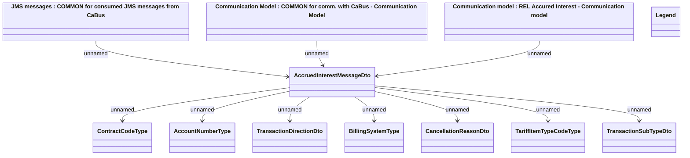

# Accured Interest -  JMS messages

```mermaid
classDiagram
    class Communication_model_REL_Accured_Interest_Communication_model["Communication model : REL Accured Interest - Communication model"]
    class Communication_Model_COMMON_for_comm_with_CaBus_Communication["Communication Model : COMMON for comm. with CaBus - Communication Model"]
    class JMS_messages_COMMON_for_consumed_JMS_messages_from_CaBus["JMS messages : COMMON for consumed JMS messages from CaBus"]
    class BillingSystemType["BillingSystemType"]
    class CancellationReasonDto["CancellationReasonDto"]
    class TransactionSubTypeDto["TransactionSubTypeDto"]
    class TransactionDirectionDto["TransactionDirectionDto"]
    class TariffItemTypeCodeType["TariffItemTypeCodeType"]
    class ContractCodeType["ContractCodeType"]
    class AccountNumberType["AccountNumberType"]
    class Legend["Legend"]
    class AccruedInterestMessageDto["AccruedInterestMessageDto"]
    JMS_messages_COMMON_for_consumed_JMS_messages_from_CaBus --> AccruedInterestMessageDto : unnamed
    Communication_Model_COMMON_for_comm_with_CaBus_Communication --> AccruedInterestMessageDto : unnamed
    Communication_model_REL_Accured_Interest_Communication_model --> AccruedInterestMessageDto : unnamed
    AccruedInterestMessageDto --> ContractCodeType : unnamed
    AccruedInterestMessageDto --> AccountNumberType : unnamed
    AccruedInterestMessageDto --> TransactionDirectionDto : unnamed
    AccruedInterestMessageDto --> BillingSystemType : unnamed
    AccruedInterestMessageDto --> CancellationReasonDto : unnamed
    AccruedInterestMessageDto --> TariffItemTypeCodeType : unnamed
    AccruedInterestMessageDto --> TransactionSubTypeDto : unnamed
```
