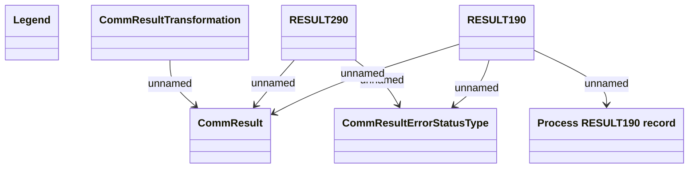

# COMMON - Communication tables

```mermaid
classDiagram
    class Process_RESULT190_record["Process RESULT190 record"]
    class Legend["Legend"]
    class CommResultErrorStatusType["CommResultErrorStatusType"]
    class CommResultTransformation["CommResultTransformation"]
    class CommResult["CommResult"]
    class RESULT190["RESULT190"]
    class RESULT290["RESULT290"]
    CommResultTransformation --> CommResult : unnamed
    RESULT290 --> CommResultErrorStatusType : unnamed
    RESULT290 --> CommResult : unnamed
    RESULT190 --> CommResultErrorStatusType : unnamed
    RESULT190 --> Process_RESULT190_record : unnamed
    RESULT190 --> CommResult : unnamed
```
