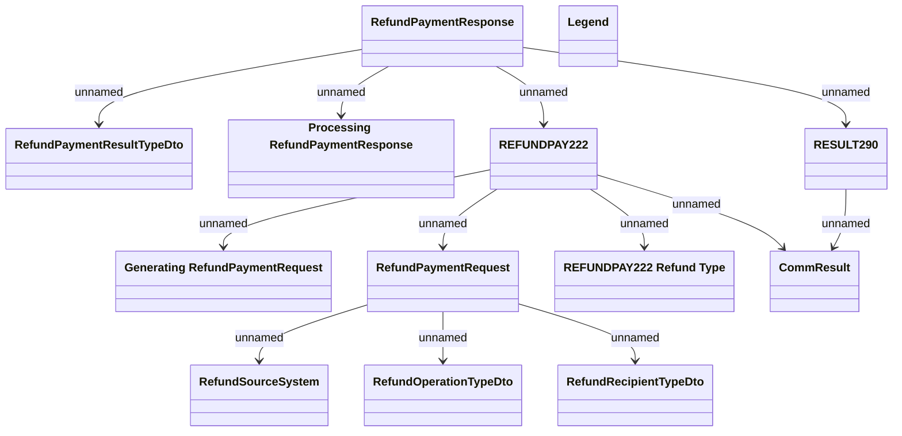

# Refunds - Communication Model

```mermaid
classDiagram
    class RefundSourceSystem["RefundSourceSystem"]
    class RefundPaymentResultTypeDto["RefundPaymentResultTypeDto"]
    class RefundOperationTypeDto["RefundOperationTypeDto"]
    class RefundRecipientTypeDto["RefundRecipientTypeDto"]
    class Processing_RefundPaymentResponse["Processing RefundPaymentResponse"]
    class Generating_RefundPaymentRequest["Generating RefundPaymentRequest "]
    class RefundPaymentResponse["RefundPaymentResponse"]
    class RefundPaymentRequest["RefundPaymentRequest"]
    class RESULT290["RESULT290"]
    class Legend["Legend"]
    class CommResult["CommResult"]
    class REFUNDPAY222_Refund_Type["REFUNDPAY222 Refund Type"]
    class REFUNDPAY222["REFUNDPAY222"]
    RefundPaymentRequest --> RefundSourceSystem : unnamed
    RESULT290 --> CommResult : unnamed
    REFUNDPAY222 --> Generating_RefundPaymentRequest : unnamed
    REFUNDPAY222 --> RefundPaymentRequest : unnamed
    REFUNDPAY222 --> REFUNDPAY222_Refund_Type : unnamed
    REFUNDPAY222 --> CommResult : unnamed
    RefundPaymentResponse --> RefundPaymentResultTypeDto : unnamed
    RefundPaymentResponse --> Processing_RefundPaymentResponse : unnamed
    RefundPaymentResponse --> REFUNDPAY222 : unnamed
    RefundPaymentResponse --> RESULT290 : unnamed
    RefundPaymentRequest --> RefundOperationTypeDto : unnamed
    RefundPaymentRequest --> RefundRecipientTypeDto : unnamed
```
