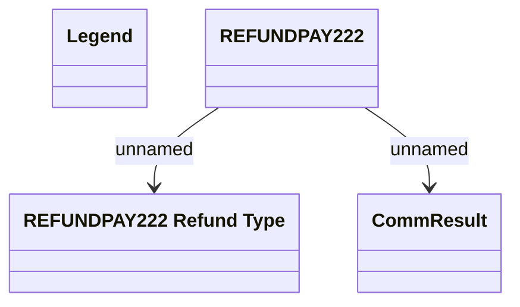

# Refunds - Communication tables

```mermaid
classDiagram
    class Legend["Legend"]
    class CommResult["CommResult"]
    class REFUNDPAY222_Refund_Type["REFUNDPAY222 Refund Type"]
    class REFUNDPAY222["REFUNDPAY222"]
    REFUNDPAY222 --> REFUNDPAY222_Refund_Type : unnamed
    REFUNDPAY222 --> CommResult : unnamed
```
