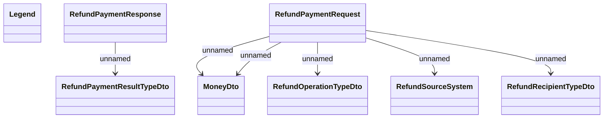

# Refunds - JMS messages

```mermaid
classDiagram
    class RefundSourceSystem["RefundSourceSystem"]
    class Legend["Legend"]
    class RefundPaymentResultTypeDto["RefundPaymentResultTypeDto"]
    class RefundPaymentResponse["RefundPaymentResponse"]
    class RefundRecipientTypeDto["RefundRecipientTypeDto"]
    class RefundOperationTypeDto["RefundOperationTypeDto"]
    class MoneyDto["MoneyDto"]
    class RefundPaymentRequest["RefundPaymentRequest"]
    RefundPaymentResponse --> RefundPaymentResultTypeDto : unnamed
    RefundPaymentRequest --> MoneyDto : unnamed
    RefundPaymentRequest --> RefundOperationTypeDto : unnamed
    RefundPaymentRequest --> RefundSourceSystem : unnamed
    RefundPaymentRequest --> MoneyDto : unnamed
    RefundPaymentRequest --> RefundRecipientTypeDto : unnamed
```
