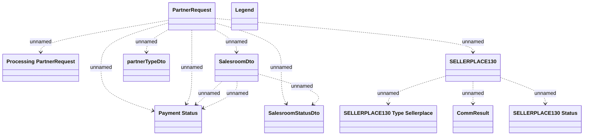

# Sales Network - Communication model

- **Diagram Type**: Logical
- **Package**: HomerSelect/BSL/Modules/CBS Adapter/Analysis model/Sales Network/Communication Model
- **Diagram ID**: 55311
- **Elements**: 11
- **Connectors**: 13

