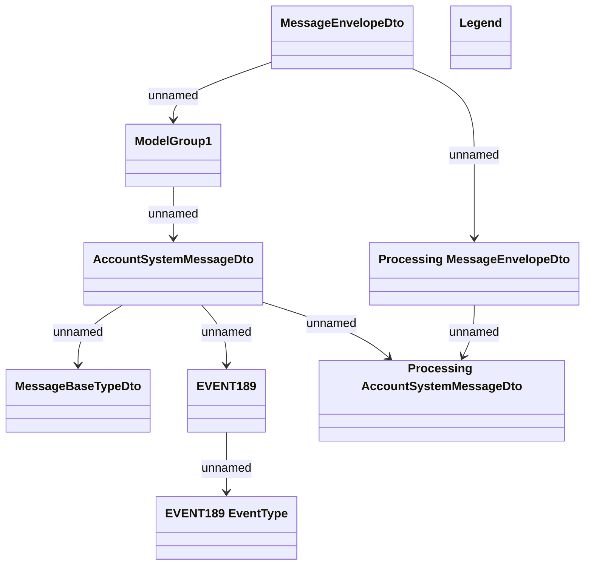

# System Messages - Communication model

```mermaid
classDiagram
    class MessageBaseTypeDto["MessageBaseTypeDto"]
    class ModelGroup1["ModelGroup1"]
    class MessageEnvelopeDto["MessageEnvelopeDto"]
    class Processing_MessageEnvelopeDto["Processing MessageEnvelopeDto
"]
    class AccountSystemMessageDto["AccountSystemMessageDto"]
    class EVENT189_EventType["EVENT189 EventType"]
    class Processing_AccountSystemMessageDto["Processing AccountSystemMessageDto"]
    class EVENT189["EVENT189"]
    class Legend["Legend"]
    EVENT189 --> EVENT189_EventType : unnamed
    AccountSystemMessageDto --> MessageBaseTypeDto : unnamed
    AccountSystemMessageDto --> EVENT189 : unnamed
    AccountSystemMessageDto --> Processing_AccountSystemMessageDto : unnamed
    Processing_MessageEnvelopeDto --> Processing_AccountSystemMessageDto : unnamed
    MessageEnvelopeDto --> ModelGroup1 : unnamed
    MessageEnvelopeDto --> Processing_MessageEnvelopeDto : unnamed
    ModelGroup1 --> AccountSystemMessageDto : unnamed
```
