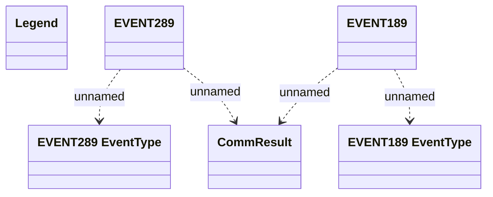

# REL System Messages - Communication tables

- **Diagram Type**: Logical
- **Package**: HomerSelect/BSL/Modules/CBS Adapter/Analysis model/System Messages/Communication model/Communication tables
- **Diagram ID**: 54353
- **Elements**: 6
- **Connectors**: 4

