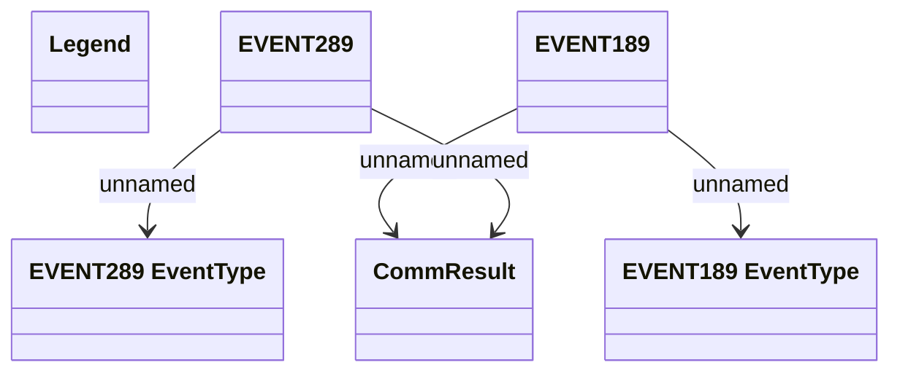

# REL System Messages - Communication tables

```mermaid
classDiagram
    class EVENT189_EventType["EVENT189 EventType"]
    class EVENT289_EventType["EVENT289 EventType"]
    class Legend["Legend"]
    class EVENT289["EVENT289"]
    class EVENT189["EVENT189"]
    class CommResult["CommResult"]
    EVENT189 --> EVENT189_EventType : unnamed
    EVENT289 --> EVENT289_EventType : unnamed
    EVENT189 --> CommResult : unnamed
    EVENT289 --> CommResult : unnamed
```
