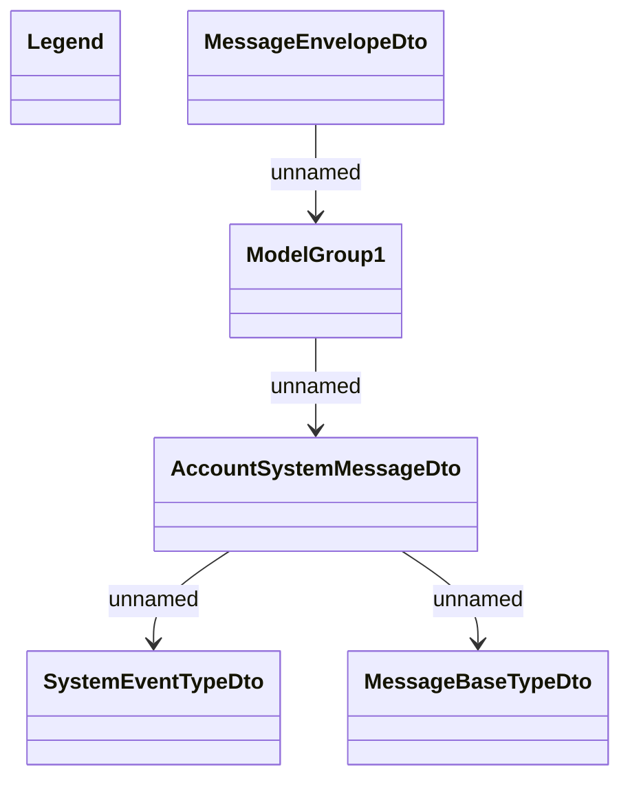

# System Messages - JMS messages

```mermaid
classDiagram
    class Legend["Legend"]
    class MessageBaseTypeDto["MessageBaseTypeDto"]
    class ModelGroup1["ModelGroup1"]
    class MessageEnvelopeDto["MessageEnvelopeDto"]
    class SystemEventTypeDto["SystemEventTypeDto"]
    class AccountSystemMessageDto["AccountSystemMessageDto"]
    AccountSystemMessageDto --> SystemEventTypeDto : unnamed
    AccountSystemMessageDto --> MessageBaseTypeDto : unnamed
    MessageEnvelopeDto --> ModelGroup1 : unnamed
    ModelGroup1 --> AccountSystemMessageDto : unnamed
```
