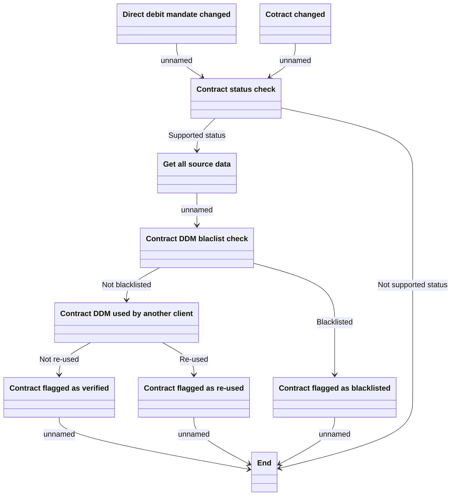

# Flow diagram

- **Diagram Type**: Logical
- **Package**: HomerSelect/BSL/Modules/CEL Account (CELA)/Architecture/Flow diagram
- **Diagram ID**: 155973
- **Elements**: 10
- **Connectors**: 12

```mermaid
classDiagram
    class Contract_flagged_as_verified["Contract flagged as verified"]
    class Contract_flagged_as_re_used["Contract flagged as re-used"]
    class Contract_DDM_used_by_another_client["Contract DDM used by another client"]
    class Contract_flagged_as_blacklisted["Contract flagged as blacklisted"]
    class Contract_DDM_blaclist_check["Contract DDM blaclist check"]
    class End["End"]
    class Get_all_source_data["Get all source data"]
    class Contract_status_check["Contract status check"]
    class Direct_debit_mandate_changed["Direct debit mandate changed"]
    class Cotract_changed["Cotract changed"]
    Direct_debit_mandate_changed --> Contract_status_check : unnamed
    Cotract_changed --> Contract_status_check : unnamed
    Contract_status_check --> Get_all_source_data : Supported status
    Contract_flagged_as_verified --> End : unnamed
    Contract_flagged_as_re_used --> End : unnamed
    Contract_flagged_as_blacklisted --> End : unnamed
    Contract_status_check --> End : Not supported status
    Get_all_source_data --> Contract_DDM_blaclist_check : unnamed
    Contract_DDM_blaclist_check --> Contract_flagged_as_blacklisted : Blacklisted
    Contract_DDM_blaclist_check --> Contract_DDM_used_by_another_client : Not blacklisted
    Contract_DDM_used_by_another_client --> Contract_flagged_as_re_used : Re-used
    Contract_DDM_used_by_another_client --> Contract_flagged_as_verified : Not re-used
```
